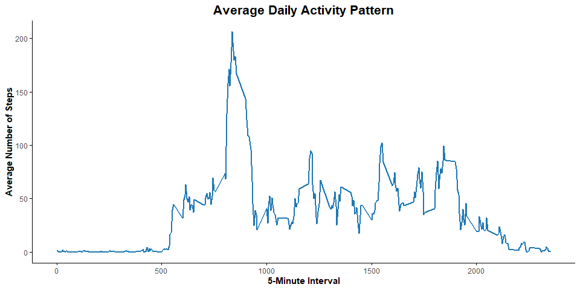

<table>
<tbody>
<tr class="odd">
<td>title: “Reproducible_Research_homework2”</td>
</tr>
<tr class="even">
<td>author: “Yipu Ding”</td>
</tr>
<tr class="odd">
<td>output: html_document</td>
</tr>
<tr class="even">
<td>date: “2025-03-11”</td>
</tr>
</tbody>
</table>

# Loading and preprocessing the data

    library(readr)
    library(dplyr)
    library(ggplot2)
    library(scales)
    Sys.setlocale("LC_TIME","English")

    ## [1] "English_United States.1252"

    # Load the dataset
    activity <- read_csv("C:/Users/aaact/Downloads/activity.csv")

# What is mean total number of steps taken per day?

## Calculate the total number of steps taken per day

    # Group by date and calculate total steps per day
    total_steps_per_date <- activity %>% 
      group_by(date) %>% 
      summarize(total_steps = sum(steps, na.rm = TRUE))

    print(total_steps_per_date)

    ## # A tibble: 61 × 2
    ##    date       total_steps
    ##    <date>           <dbl>
    ##  1 2012-10-01           0
    ##  2 2012-10-02         126
    ##  3 2012-10-03       11352
    ##  4 2012-10-04       12116
    ##  5 2012-10-05       13294
    ##  6 2012-10-06       15420
    ##  7 2012-10-07       11015
    ##  8 2012-10-08           0
    ##  9 2012-10-09       12811
    ## 10 2012-10-10        9900
    ## # ℹ 51 more rows

## Make a histogram of the total number of steps taken each day

    # Create a bar plot (histogram) of total steps per day
    ggplot(total_steps_per_date, aes(x = date, y = total_steps)) +
      geom_bar(
        stat = "identity", 
        fill = "#F69B85",  # Bar fill color
        color = "black",   # Bar border color (black and thin)
        alpha = 0.8,       # Transparency
        width = 0.8,       # Bar width
        size = 0.3         # Border thickness
      ) +
      labs(
        title = "Total Steps Taken Per Day",  
        x = "Date", 
        y = "Total Steps"
      ) +
      theme_minimal() +  
      theme(
        plot.title = element_text(hjust = 0.5, face = "bold", size = 16),  
        axis.title = element_text(face = "bold"),  
        axis.line = element_line(color = "black", size = 0.5),  
        axis.ticks = element_line(color = "black", size = 0.5),  
        panel.grid.major = element_blank(),
        panel.grid.minor = element_blank(), 
        panel.background = element_blank() 
      ) +
      scale_y_continuous(labels = scales::comma)  # Format y-axis labels with commas

## Calculate and report the mean and median of the total number of steps taken per day

    # Calculate mean and median steps per day
    mean_median_steps <- activity %>% 
      group_by(date) %>% 
      summarize(
        total_steps_mean = mean(steps, na.rm = TRUE),
        total_steps_median = median(steps, na.rm = TRUE)
      )

    print(mean_median_steps)

    ## # A tibble: 61 × 3
    ##    date       total_steps_mean total_steps_median
    ##    <date>                <dbl>              <dbl>
    ##  1 2012-10-01          NaN                     NA
    ##  2 2012-10-02            0.438                  0
    ##  3 2012-10-03           39.4                    0
    ##  4 2012-10-04           42.1                    0
    ##  5 2012-10-05           46.2                    0
    ##  6 2012-10-06           53.5                    0
    ##  7 2012-10-07           38.2                    0
    ##  8 2012-10-08          NaN                     NA
    ##  9 2012-10-09           44.5                    0
    ## 10 2012-10-10           34.4                    0
    ## # ℹ 51 more rows

# What is the average daily activity pattern?

## Make a time series plot (i.e. type = “l”) of the 5-minute interval (x-axis) and the average number of steps taken, averaged across all days (y-axis)

    # Group by interval and calculate average steps
    activity_time_series <- activity %>%
      group_by(interval) %>%
      summarize(average_steps = mean(steps, na.rm = TRUE))

    # Create a time series plot
    ggplot(activity_time_series, aes(x = interval, y = average_steps)) +
      geom_line(color = "#1F78B4", size = 0.8) +  
      labs(
        title = "Average Daily Activity Pattern",
        x = "5-Minute Interval", 
        y = "Average Number of Steps"
      ) +
      theme_minimal() +  
      theme(
        plot.title = element_text(hjust = 0.5, face = "bold", size = 16),  
        axis.title = element_text(face = "bold"),  
        axis.line = element_line(color = "black", size = 0.5),  
        axis.ticks = element_line(color = "black", size = 0.5),  
        panel.grid.major = element_blank(), 
        panel.grid.minor = element_blank(), 
        panel.background = element_blank() 
      )

## Which 5-minute interval, on average across all the days in the dataset, contains the maximum number of steps?

    # Find the interval with the maximum average steps
    max_interval <- activity_time_series %>%
      filter(average_steps == max(average_steps, na.rm = TRUE))

    print(max_interval)

    ## # A tibble: 1 × 2
    ##   interval average_steps
    ##      <dbl>         <dbl>
    ## 1      835          206.

The answer is 8:35, with 206 average steps.

# Imputing missing values

## Calculate and report the total number of missing values in the dataset

    # Count the number of rows with missing steps
    missing_rows <- activity %>% filter(is.na(steps))
    nrow(missing_rows)

    ## [1] 2304

The total number of missing values was 2304.

## Devise a strategy for filling in all of the missing values in the dataset. The strategy does not need to be sophisticated.

## Create a new dataset that is equal to the original dataset but with the missing data filled in.

Here, I will fill in the missing values using the mean of the 5-minute
interval.

    # Fill missing values with the mean for that 5-minute interval
    activity_filled <- activity %>%
      group_by(interval) %>%
      mutate(steps = ifelse(is.na(steps), mean(steps, na.rm = TRUE), steps))

    print(activity_filled)

    ## # A tibble: 17,568 × 3
    ## # Groups:   interval [288]
    ##     steps date       interval
    ##     <dbl> <date>        <dbl>
    ##  1 1.72   2012-10-01        0
    ##  2 0.340  2012-10-01        5
    ##  3 0.132  2012-10-01       10
    ##  4 0.151  2012-10-01       15
    ##  5 0.0755 2012-10-01       20
    ##  6 2.09   2012-10-01       25
    ##  7 0.528  2012-10-01       30
    ##  8 0.868  2012-10-01       35
    ##  9 0      2012-10-01       40
    ## 10 1.47   2012-10-01       45
    ## # ℹ 17,558 more rows

## Make a histogram of the total number of steps taken each day and Calculate and report the mean and median total number of steps taken per day.

    # Calculate total steps per day with imputed data
    total_steps_per_date_filled <- activity_filled %>% 
      group_by(date) %>% 
      summarize(total_steps = sum(steps, na.rm = TRUE))

    # Create a bar plot (histogram) with imputed data
    ggplot(total_steps_per_date_filled, aes(x = date, y = total_steps)) +
      geom_bar(
        stat = "identity", 
        fill = "#F69B85",  # Bar fill color
        color = "black",   # Bar border color (black and thin)
        alpha = 0.8,       # Transparency
        width = 0.8,       # Bar width
        size = 0.3         # Border thickness
      ) +
      labs(
        title = "Total Steps Taken Per Day (with Imputed Data)", 
        x = "Date", 
        y = "Total Steps"
      ) +
      theme_minimal() +  
      theme(
        plot.title = element_text(hjust = 0.5, face = "bold", size = 16),  
        axis.title = element_text(face = "bold"),  
        axis.line = element_line(color = "black", size = 0.5),  
        axis.ticks = element_line(color = "black", size = 0.5),  
        panel.grid.major = element_blank(),  # Remove major grid lines
        panel.grid.minor = element_blank(),  # Remove minor grid lines
        panel.background = element_blank()   # Remove background
      ) +
      scale_y_continuous(labels = scales::comma)  

    # Calculate mean and median with imputed data
    mean_median_steps_filled <- activity_filled %>% 
      group_by(date) %>% 
      summarize(
        total_steps_mean = mean(steps, na.rm = TRUE),
        total_steps_median = median(steps, na.rm = TRUE)
      )

    print(mean_median_steps_filled)

    ## # A tibble: 61 × 3
    ##    date       total_steps_mean total_steps_median
    ##    <date>                <dbl>              <dbl>
    ##  1 2012-10-01           37.4                 34.1
    ##  2 2012-10-02            0.438                0  
    ##  3 2012-10-03           39.4                  0  
    ##  4 2012-10-04           42.1                  0  
    ##  5 2012-10-05           46.2                  0  
    ##  6 2012-10-06           53.5                  0  
    ##  7 2012-10-07           38.2                  0  
    ##  8 2012-10-08           37.4                 34.1
    ##  9 2012-10-09           44.5                  0  
    ## 10 2012-10-10           34.4                  0  
    ## # ℹ 51 more rows

# Are there differences in activity patterns between weekdays and weekends?

## Create a new factor variable in the dataset with two levels – “weekday” and “weekend” indicating whether a given date is a weekday or weekend day.

    # Add a new column to distinguish weekdays and weekends
    activity_weekday <- activity %>% 
      mutate(weekday = weekdays(date)) %>% 
      mutate(weekday_or_end = ifelse(weekday %in% c("Saturday", "Sunday"), "weekend", "weekday"))

    print(activity_weekday)

    ## # A tibble: 17,568 × 5
    ##    steps date       interval weekday weekday_or_end
    ##    <dbl> <date>        <dbl> <chr>   <chr>         
    ##  1    NA 2012-10-01        0 Monday  weekday       
    ##  2    NA 2012-10-01        5 Monday  weekday       
    ##  3    NA 2012-10-01       10 Monday  weekday       
    ##  4    NA 2012-10-01       15 Monday  weekday       
    ##  5    NA 2012-10-01       20 Monday  weekday       
    ##  6    NA 2012-10-01       25 Monday  weekday       
    ##  7    NA 2012-10-01       30 Monday  weekday       
    ##  8    NA 2012-10-01       35 Monday  weekday       
    ##  9    NA 2012-10-01       40 Monday  weekday       
    ## 10    NA 2012-10-01       45 Monday  weekday       
    ## # ℹ 17,558 more rows

## Make a panel plot containing a time series plot of the 5-minute interval (x-axis) and the average number of steps taken, averaged across all weekday days or weekend days (y-axis).

    # Calculate average steps per interval for weekdays and weekends
    activity_time_series_weekday <- activity_weekday %>%
      group_by(interval, weekday_or_end) %>%
      summarize(average_steps = mean(steps, na.rm = TRUE))

    # Create a panel plot with separate lines for weekdays and weekends
    ggplot(activity_time_series_weekday, aes(x = interval, y = average_steps, color = weekday_or_end)) +
      geom_line(size = 0.8) +  
      facet_wrap(~weekday_or_end, ncol = 1, scales = "free_x") +  # Ensure each panel has its own x-axis
      labs(
        title = "Average Daily Activity Pattern (Weekday vs. Weekend)",
        x = "5-Minute Interval", 
        y = "Average Number of Steps",
        color = "Day Type"
      ) +
      theme_minimal() +  
      theme(
        plot.title = element_text(hjust = 0.5, face = "bold", size = 16),  
        axis.title = element_text(face = "bold"),  
        axis.line = element_line(color = "black", size = 0.5),  
        axis.ticks = element_line(color = "black", size = 0.5),  
        panel.grid.major = element_blank(),  # Remove major grid lines
        panel.grid.minor = element_blank(),  # Remove minor grid lines
        panel.background = element_blank(),  # Remove background
        strip.text = element_text(face = "bold", size = 12)  # Style facet labels
      ) +
      scale_color_manual(values = c("weekday" = "#1F78B4", "weekend" = "#33A02C"))  # Custom line colors

There are differences in activity patterns between weekdays and
weekends. Here are some observations:

1.  Activity Intensity: On weekdays, activity intensity may be higher
    during specific times, such as early morning and late afternoon,
    likely due to commuting and work-related activities. On weekends,
    activity might be more evenly distributed, with potential peaks
    during mid-morning or early afternoon.

2.  Activity Distribution: Weekend activities appear to be more spread
    out without distinct peaks, reflecting a more relaxed schedule and
    varied leisure activities.

3.  Peak Times: Weekdays may show activity peaks in the morning and
    evening, while weekends could have peaks during mid-morning or early
    afternoon.

4.  Activity Volume: Overall, activity levels on weekends might be
    higher during certain periods compared to weekdays, possibly because
    people have more free time for exercise or outdoor activities.
